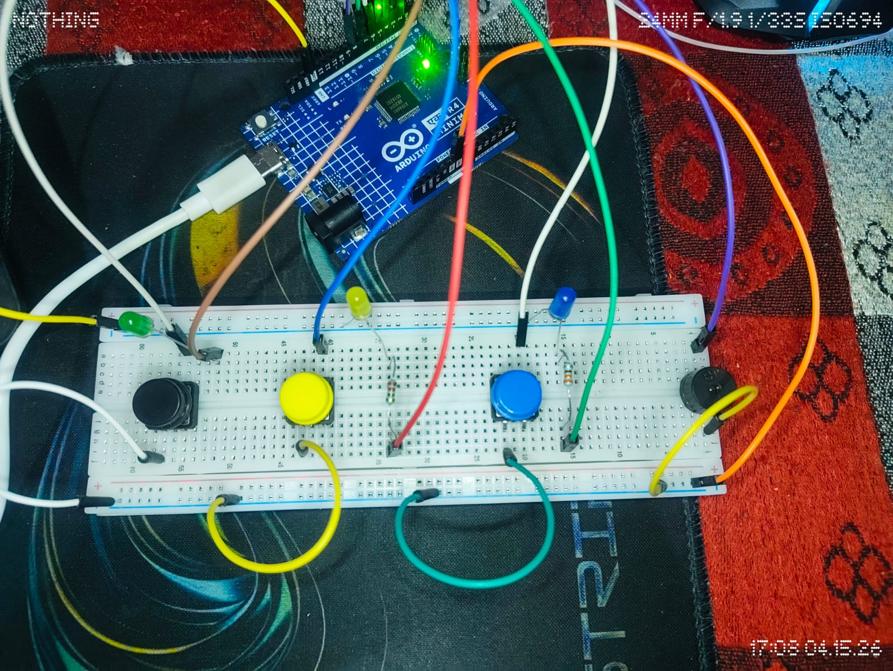
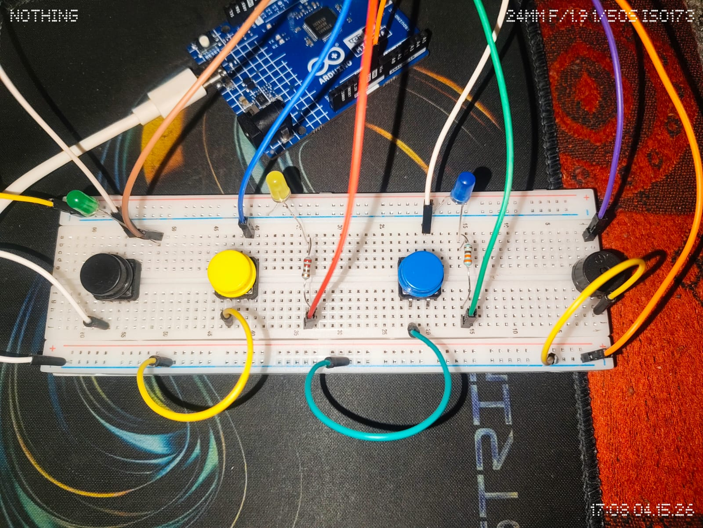

# 🎮 Color Memory Game – Arduino

A simple Arduino-based memory game inspired by the classic **Simon Game**, where players must repeat an increasing sequence of lights and sounds.

---

## 🚀 Features

* Random LED sequence generation
* Increasing difficulty levels
* Button-based user input
* LED + buzzer feedback
* Game over and restart system

---

## 🛠️ Components Used

* Arduino UNO
* LEDs (3x)
* Push Buttons (3x)
* Buzzer
* Resistors
* Breadboard & Jumper Wires

---

## 🔌 Circuit Setup

### Connections Overview:

* LEDs → Digital pins (with resistors)
* Buttons → Digital pins using `INPUT_PULLUP`
* Buzzer → Digital pin (e.g., pin 8)
* All components share common GND

---

## ▶️ How to Run

1. Open `Memory_game_code.ino` in Arduino IDE
2. Connect components as shown above
3. Select the correct board and port
4. Upload the code
5. Watch the LED sequence and repeat it using buttons

---

## 🎮 How It Works

1. Arduino generates a random sequence
2. LEDs blink in order
3. Player repeats using buttons
4. Correct → next level
5. Wrong → game over

---

## 🎯 Controls

| Button   | Action  |
| -------- | ------- |
| Button 1 | Input 1 |
| Button 2 | Input 2 |
| Button 3 | Input 3 |

---

## 📹 Demo

[Watch Demo](./Demo_play.mp4)

---

## 💡 Learning Outcome

* Working with arrays and sequences
* Handling button input & debouncing
* Timing control using delays
* Building interactive systems

---

## 👨‍💻 Author

Nikhil Kunwar

---

## ⭐ If you like this project

Give it a star ⭐ and try building your own version!
 
